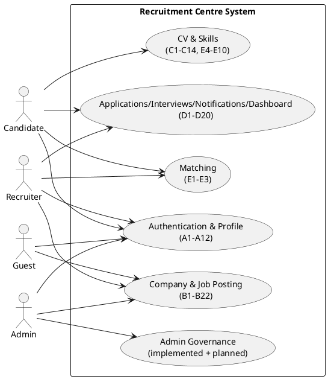
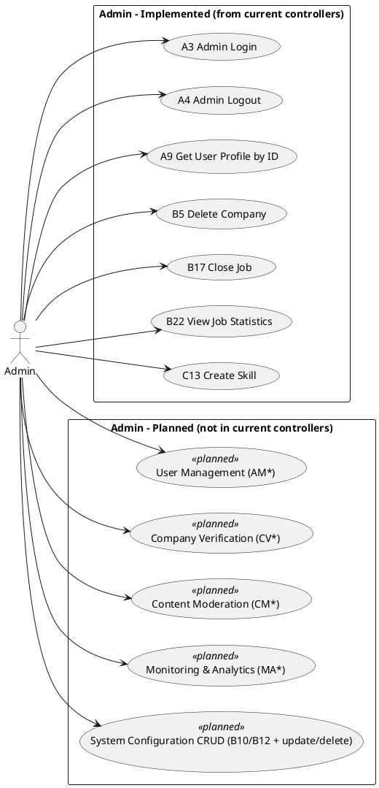

# Rà soát Use Case Diagram từ toàn bộ `controller/`

## 1) Phạm vi đối soát

Đã rà soát toàn bộ controller hiện có trong `src/main/java/com/example/tuyendung/controller`:

- `AuthController`
- `UserController`
- `CompanyController`
- `NganhNgheController`
- `KhuVucController`
- `TinTuyenDungController`
- `HoSoCvController`
- `ChiTietCvController`
- `SkillsController`
- `CvSkillController`
- `JobSkillController`
- `MatchingController`
- `DonUngTuyenController`
- `LichPhongVanController`
- `ThongBaoController`
- `DashboardController`

Và toàn bộ Use Case hiện tại ở `uml/*/UseCase/*.puml` (27 file).

---

## 2) Kết luận nhanh

**Use Case diagram hiện tại chưa đủ và chưa sát implementation backend**.

- Có nhiều use case gán **sai ID nghiệp vụ** (đặc biệt B16/B17/B18, D6).
- Có use case mô tả **quyền actor không khớp** với `@PreAuthorize` thực tế.
- Nhóm Admin có nhiều use case đang ở trạng thái **planned** nhưng đang vẽ như đã hoạt động.
- ID đặt tên đang lẫn giữa `A/B/C/D/E` với `AM/CM/CV/SM/NM/MA`, khó trace 1-1 từ controller.

---

## 3) Findings chính (ưu tiên theo mức độ)

###[P0] Sai nghĩa nghiệp vụ D6 (Candidate)
- `uml/Candidate/UseCase/Candidate_Applications.puml:12,19` đang ghi **Cancel Application** = `D6`.
- Nhưng `src/main/java/com/example/tuyendung/controller/DonUngTuyenController.java:122-136` định nghĩa `D6` là **Recruiter reject application** (`PATCH /api/applications/{id}/reject`).
- Tác động: sai luồng nghiệp vụ lõi ứng tuyển, làm lệch sequence/activity downstream.

###[P0] Sai mapping B16/B17/B18 trong Candidate Job Search
- `uml/Candidate/UseCase/Candidate_JobSearch.puml:10-13,20-23` mô tả:
  - `B16` = filter salary
  - `B17` = filter location
  - `B18` = filter industry
- Nhưng `src/main/java/com/example/tuyendung/controller/TinTuyenDungController.java:96-114`:
  - `B16` = recruiter update job
  - `B17` = close job
  - `B18` = recruiter my-jobs (xem trong file controller phần trên)
- Tác động: lệch ID xuyên module B, khó kiểm soát traceability.

###[P0] Recruiter_Company mô tả xóa công ty không đúng quyền
- `uml/Recruiter/UseCase/Recruiter_Company.puml:12,23` mô tả recruiter xóa công ty (`B5`).
- `src/main/java/com/example/tuyendung/controller/CompanyController.java:63-65` yêu cầu `ROLE_ADMIN` cho delete company.
- Tác động: sai phân quyền ở tài liệu phân tích thiết kế.

###[P1] Admin System Configuration không khớp thực tế enum tĩnh
- `uml/Admin/UseCase/Admin_SystemConfiguration.puml:9-11,16-18` mô tả create/update/delete industry/location.
- `src/main/java/com/example/tuyendung/controller/NganhNgheController.java:18-20` và `src/main/java/com/example/tuyendung/controller/KhuVucController.java:18-19` xác nhận danh mục hiện là enum cố định (không có CRUD runtime API).
- Tác động: vẽ vượt phạm vi implementation hiện tại.

###[P1] Thiếu phân loại trạng thái Implemented vs Planned cho Admin
- `uml/Admin/UseCase/Admin_UserManagement.puml` và `uml/Admin/UseCase/Admin_ContentModeration.puml` đang vẽ đầy đủ chức năng, nhưng hiện chưa có controller tương ứng trong `controller/`.
- Tác động: người đọc hiểu nhầm đã có API sản xuất.

###[P1] Bất nhất quy tắc quyền ở Skills
- `src/main/java/com/example/tuyendung/controller/SkillsController.java:92-107` chưa có `@PreAuthorize` cho update/delete skill, trong khi create skill có admin guard.
- Use case admin skills cần đánh dấu rõ: hiện trạng implementation đang mở quyền hơn mong đợi.

###[P2] ID scheme không nhất quán
- Các file admin dùng `AM*`, `CV*`, `CM*`, `SM*`, `NM*`, `MA*` thay vì cùng chuẩn `A/B/C/D/E`.
- Tác động: giảm khả năng trace từ requirement -> controller -> test -> UML.

---

## 4) Đề xuất chuẩn tái cấu trúc Use Case

### 4.1. Nguyên tắc chuẩn hóa

1. **Controller-first truth**: use case “Implemented” chỉ lấy từ endpoint thực có trong controller.
2. **Tách trạng thái rõ ràng**:
   - `Implemented`
   - `Planned`
   - `Out of scope (current release)`
3. **Thống nhất mã use case** theo `A/B/C/D/E + số`.
4. **Mỗi use case có metadata tối thiểu**: actor, endpoint, auth rule, source controller method.
5. **Không dùng 1 mã cho 2 nghĩa khác nhau** (case D6, B16/B17/B18).

### 4.2. Cấu trúc file đề xuất (v2)

```text
uml/
  UseCase_v2/
    00_System_Overview.puml
    01_Shared_Common.puml
    10_Candidate_Complete.puml
    20_Recruiter_Complete.puml
    30_Admin_Implemented.puml
    31_Admin_Planned.puml
    90_UseCase_Catalog.md
```

- `00_System_Overview.puml`: big-picture actor-context.
- `01_Shared_Common.puml`: Auth + taxonomy + public listings + thông báo dùng chung.
- `10/20`: đầy đủ theo actor chính.
- `30`: admin đã có endpoint thật.
- `31`: admin planned, ghi rõ stereotype `<<planned>>`.
- `90_UseCase_Catalog.md`: bảng trace endpoint <-> use case.

---

## 5) Kế hoạch triển khai tái cấu trúc

### Phase 1 - Ổn định mô hình hiện tại (nhanh)
- Sửa sai mapping P0 ở các file Candidate/Recruiter hiện hữu.
- Gắn nhãn trạng thái cho từng use case (`Implemented/Planned`).
- Chốt danh sách ID chuẩn A-E cho release hiện tại.

### Phase 2 - Tạo bộ Use Case hoàn chỉnh v2
- Tạo bộ file mới `UseCase_v2` theo cấu trúc trên.
- Tạo `90_UseCase_Catalog.md` làm nguồn trace chuẩn.
- Giữ file cũ để đối chiếu trong giai đoạn chuyển tiếp.

### Phase 3 - Khóa chuẩn tài liệu
- Đánh dấu file cũ là legacy.
- Quy định checklist bắt buộc khi thêm endpoint mới:
  - cập nhật `90_UseCase_Catalog.md`
  - cập nhật 1 file actor diagram tương ứng
  - cập nhật sequence/activity liên quan.

---

## 6) Bộ PlantUML tổng hợp hoàn chỉnh (đề xuất đưa vào v2)

> Mục tiêu phần này là cung cấp bản **hệ thống hoàn chỉnh** ở mức Use Case, có phân biệt rõ `implemented` và `planned`.

```puml
@startuml Candidate_Complete
left to right direction

actor Candidate as UV

rectangle "Candidate Use Cases" {
  usecase "A1 Register Candidate" as A1
  usecase "A3 Login" as A3
  usecase "A4 Logout" as A4
  usecase "A5 Refresh Token" as A5
  usecase "A6 Forgot Password" as A6
  usecase "A7 Reset Password" as A7
  usecase "A8 Verify Email" as A8
  usecase "A9 View Profile" as A9
  usecase "A10 Update Candidate Profile" as A10
  usecase "A11 Change Password" as A11
  usecase "A12 Upload Avatar" as A12

  usecase "C1 Create CV" as C1
  usecase "C2 List CV" as C2
  usecase "C3 View CV Detail" as C3
  usecase "C4 Update CV" as C4
  usecase "C5 Delete CV" as C5
  usecase "C6 Set Default CV" as C6
  usecase "C7 Upload CV File" as C7
  usecase "C8 Add Education/Experience" as C8
  usecase "C9 List Education/Experience" as C9
  usecase "C10 Update Education/Experience" as C10
  usecase "C11 Delete Education/Experience" as C11
  usecase "C12 View Skills Catalog" as C12
  usecase "C14 Search Skills" as C14

  usecase "E2 Job Recommendation" as E2
  usecase "E3 Match Score" as E3
  usecase "E4 Add CV Skill" as E4
  usecase "E5 List CV Skills" as E5
  usecase "E6 Update CV Skill" as E6
  usecase "E7 Remove CV Skill" as E7

  usecase "B14 View Active Jobs" as B14
  usecase "B15 View Job Detail" as B15
  usecase "B19 Search Jobs" as B19

  usecase "D1 Submit Application" as D1
  usecase "D2 List My Applications" as D2
  usecase "D4 View Application Detail" as D4
  usecase "D8 View Application History" as D8
  usecase "D10 View Interview List" as D10
  usecase "D11 View Interview Detail" as D11
  usecase "D15 View Notifications" as D15
  usecase "D16 Mark Notification Read" as D16
  usecase "D17 Count Unread Notifications" as D17
  usecase "D18 Mark All Notifications Read" as D18
  usecase "D19 View Candidate Dashboard" as D19
}

UV --> A1
UV --> A3
A3 --> A5
UV --> A4
UV --> A6
A6 --> A7
UV --> A8
UV --> A9
UV --> A10
UV --> A11
UV --> A12

UV --> C1
UV --> C2
UV --> C3
UV --> C4
UV --> C5
UV --> C6
UV --> C7
UV --> C8
UV --> C9
UV --> C10
UV --> C11
UV --> C12
UV --> C14

UV --> B14
UV --> B15
UV --> B19
UV --> E2
UV --> E3
UV --> E4
UV --> E5
UV --> E6
UV --> E7

UV --> D1
UV --> D2
UV --> D4
UV --> D8
UV --> D10
UV --> D11
UV --> D15
UV --> D16
UV --> D17
UV --> D18
UV --> D19
@enduml
```

```puml
@startuml Recruiter_Complete
left to right direction

actor Recruiter as NTD

rectangle "Recruiter Use Cases" {
  usecase "A2 Register Recruiter" as A2
  usecase "A3 Login" as A3
  usecase "A4 Logout" as A4
  usecase "A5 Refresh Token" as A5
  usecase "A6 Forgot Password" as A6
  usecase "A7 Reset Password" as A7
  usecase "A8 Verify Email" as A8
  usecase "A9 View Profile" as A9
  usecase "A10 Update Recruiter Profile" as A10
  usecase "A11 Change Password" as A11
  usecase "A12 Upload Avatar" as A12

  usecase "B1 Create Company" as B1
  usecase "B3 View Company Detail" as B3
  usecase "B4 Update Company" as B4
  usecase "B6 Verify Tax" as B6
  usecase "B7 Set Company Industries" as B7
  usecase "B8 View Company Industries" as B8
  usecase "B9 View Industries Catalog" as B9
  usecase "B11 View Locations Catalog" as B11

  usecase "B13 Create Job" as B13
  usecase "B15 View Job Detail" as B15
  usecase "B16 Update Job" as B16
  usecase "B17 Close Job" as B17
  usecase "B18 View My Jobs" as B18
  usecase "B19 Search Jobs" as B19
  usecase "B20 Set Job Locations" as B20
  usecase "B21 View Job Locations" as B21
  usecase "B22 View Job Statistics" as B22

  usecase "E1 Candidate Recommendation" as E1
  usecase "E3 Match Score" as E3
  usecase "E8 Add Job Skill Requirement" as E8
  usecase "E9 List Job Skill Requirements" as E9
  usecase "E10 Update Job Skill Requirement" as E10

  usecase "D3 List Applications For Job" as D3
  usecase "D4 View Application Detail" as D4
  usecase "D5 Update Application Status" as D5
  usecase "D6 Reject Application" as D6
  usecase "D7 View CV Snapshot" as D7
  usecase "D8 View Application History" as D8

  usecase "D9 Schedule Interview" as D9
  usecase "D10b List My Interviews" as D10b
  usecase "D10 List Interviews By Application" as D10
  usecase "D11 View Interview Detail" as D11
  usecase "D12 Update Interview" as D12
  usecase "D13 Cancel Interview" as D13
  usecase "D14 Reschedule Interview" as D14

  usecase "D15 View Notifications" as D15
  usecase "D16 Mark Notification Read" as D16
  usecase "D17 Count Unread Notifications" as D17
  usecase "D18 Mark All Notifications Read" as D18
  usecase "D20 View Recruiter Dashboard" as D20
}

NTD --> A2
NTD --> A3
A3 --> A5
NTD --> A4
NTD --> A6
A6 --> A7
NTD --> A8
NTD --> A9
NTD --> A10
NTD --> A11
NTD --> A12

NTD --> B1
NTD --> B3
NTD --> B4
NTD --> B6
NTD --> B7
NTD --> B8
NTD --> B9
NTD --> B11
NTD --> B13
NTD --> B15
NTD --> B16
NTD --> B17
NTD --> B18
NTD --> B19
NTD --> B20
NTD --> B21
NTD --> B22

NTD --> E1
NTD --> E3
NTD --> E8
NTD --> E9
NTD --> E10

NTD --> D3
NTD --> D4
NTD --> D5
NTD --> D6
NTD --> D7
NTD --> D8
NTD --> D9
NTD --> D10b
NTD --> D10
NTD --> D11
NTD --> D12
NTD --> D13
NTD --> D14
NTD --> D15
NTD --> D16
NTD --> D17
NTD --> D18
NTD --> D20
@enduml
```









---

## 7) Checklist khi cập nhật endpoint mới (đề xuất áp dụng ngay)

- [ ] Gán ID use case chuẩn (`A/B/C/D/E`).
- [ ] Cập nhật `90_UseCase_Catalog.md` (endpoint + role + status).
- [ ] Cập nhật đúng file actor (`10_...` hoặc `20_...` hoặc `30_...`).
- [ ] Nếu chưa implement API: đánh dấu `<<planned>>`.
- [ ] Đồng bộ sequence/activity tương ứng.

---

## 8) Ghi chú theo mẫu tài liệu

Để bám sát phong cách mẫu (`ĐỀ MẪU DỰ ÁN.pdf`), nên giữ chuẩn:
- Diagram theo module, có mã use case rõ ràng.
- Có phân lớp actor và phạm vi hệ thống rõ (system boundary).
- Có truy vết requirement -> endpoint -> test case.
- Trạng thái use case rõ ràng (không để planned lẫn với implemented).

